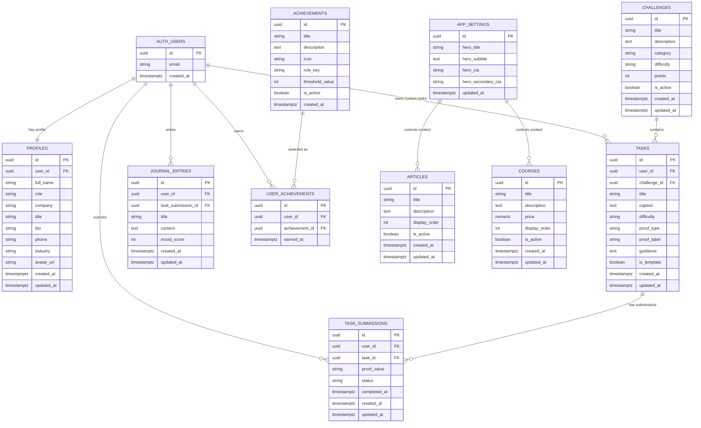

# BoostMe ERD

המודל הבא מציג מבנה נתונים מומלץ עבור גרסת Supabase מלאה של BoostMe. בגרסת הדמו חלק מהמידע נשמר ב-LocalStorage, אך ה-ERD מתאים למעבר למסד נתונים אמיתי.

## הערות מימוש

- `profiles.role` יכול להיות `admin` או `user`, אך בהרשאות רגישות מומלץ לשמור הרשאת Admin גם ב-`app_metadata`.
- `tasks.proof_type` יכול להיות `checklist`, `link` או `text`.
- `task_submissions.proof_value` שומר קישור לקובץ, קישור למצגת, או תיאור קצר של התוצר.
- `tasks.is_template=true` מתאים למשימות מערכת כלליות. משימות אישיות של משתמש יקבלו `user_id`.
- `journal_entries.task_submission_id` אופציונלי, כדי לאפשר גם כתיבת יומן כללית שאינה קשורה למשימה.
- יש להפעיל Row Level Security על כל הטבלאות ב-public schema.
- משתמש רגיל צריך לקבל גישה רק לרשומות שלו לפי `auth.uid() = user_id`.
- Admin יכול לקבל מדיניות נפרדת לניהול תוכן כמו `articles`, `courses`, `challenges` ו-`app_settings`.
